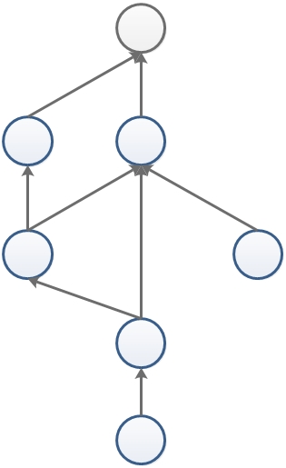
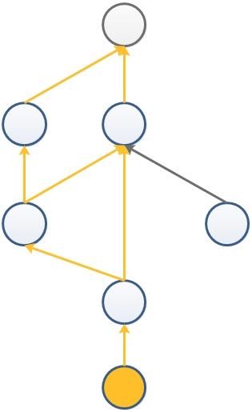
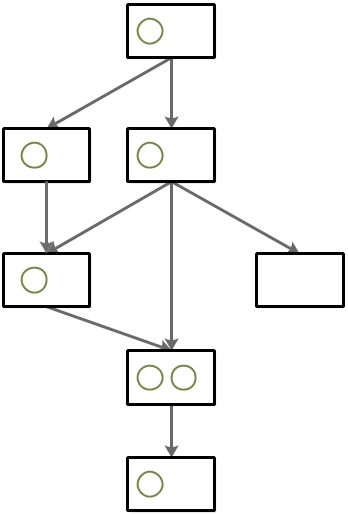
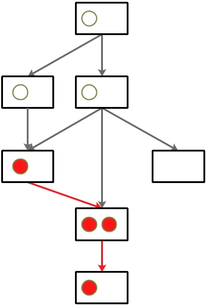

# Structure of tasks / workers

Tasks / workers managed by WinCAMP assemble a __Directed Acyclic Graph (DAG)__, which ensures that all depenedency workers have been generated before the actual task starts.

## Tasks

For the __tasks__ DAG, which contain information of all applications to be executed, each node must hold the reference of its parents to track the total workers to start BEFORE it, thus performs a bottom-up structure.

When a specific worker is to be created, the reference to parents can then be checked recursively to generate a running queue.

## Workers

However, that's not the case when it comes to the __workers__ DAG. Because parent workers must be terminated AFTER all of its offsprings close, the references holding have to be reversed.

What's more, one task can generate multiple workers, thus __slots__ forming the same structure of tasks diagram can be convenient.

When a worker is to be terminated, all offsprings are then be terminated BEFORE its termination.

Nevertheless, if there are any workers generated from the same task still running, the offsprings retain. Thus, the termination of only happens when the LAST worker in the slot is to be terminated.